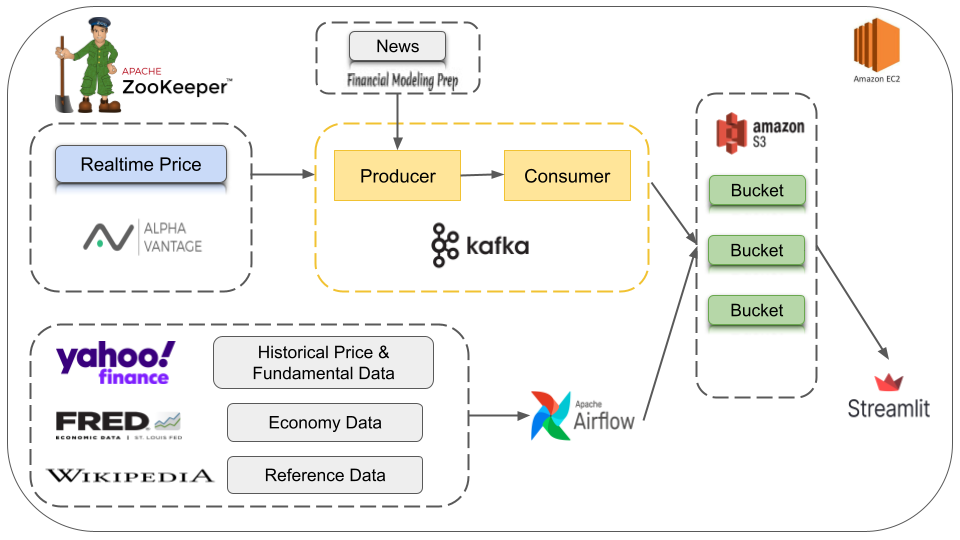

# Real-Time Financial Report Dashboard

Welcome to the Real-Time Financial Report project! This repository contains a comprehensive real-time financial reporting dashboard designed to analyze and assess the health of the stock market. It offers valuable insights into both technical and fundamental indicators, as well as the latest news, empowering potential investors to make informed decisions.

## Project Overview
In today's fast-paced financial landscape, having access to up-to-the-minute information is crucial for making well-informed investment choices. This project addresses that need by leveraging Python, Kafka, Airflow, and Streamlit to create a holistic solution.

Here is the overall architecture of the platform. 


Page 1 (Overall Stock Market):
https://github.com/JoyChen037/real_time_financial_report/assets/105028672/63d9ba11-aa41-4b87-90ac-aa6fa57ead2a

Page 2 (Individual Security):
https://github.com/JoyChen037/real_time_financial_report/assets/105028672/2f9c3768-15ad-4dbd-97a6-25b1880a9df5


### Features
**Real-Time Data Processing**: We utilize Kafka for real-time data processing, ensuring that the dashboard displays the most current market data and updates without delay.

**Comprehensive Insights**: The dashboard provides a wide array of insights, including technical indicators (e.g., moving averages, RSI), fundamental indicators (e.g., earnings per share, P/E ratio), and the latest news relevant to the market.

**User-Friendly Interface**: We use Streamlit to create a user-friendly web-based interface, making it easy for investors, both new and experienced, to access and interpret the information presented.

**ETL Automation**: Airflow is employed for ETL (Extract, Transform, Load) job scheduling, ensuring that the data is regularly updated and processed, maintaining the dashboard's accuracy and relevance.

## Getting Started
To run this project locally, follow these steps:

1. **Clone the Repository**: Start by cloning this repository to your local machine.
```
git clone https://github.com/JoyChen037/real_time_financial_report.git
cd real-time-financial-report
```
2. **Install Dependencies**: Install the required dependencies by running:
```
pip install -r requirements.txt
```
3. **Set Up Kafka**: Ensure you have Kafka installed and running. Configure the necessary Kafka topics and connections in the configuration files.

4. **Configure Airflow**: Set up Airflow to schedule ETL jobs. Configure the necessary connections and DAGs in the Airflow configuration.

5. **Run the Streamlit App**: Navigate to the streamlit_app directory and run the Streamlit app:
```
cd streamlit_app
streamlit run Home.py
```
